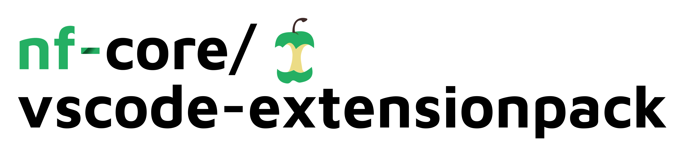

# 

**An extension pack for [VSCode](https://code.visualstudio.com/) with all the tools you'll need to develop with [nf-core](https://nf-co.re/)**, a community effort to collect a curated set of analysis pipelines built using Nextflow.

Note - not all of these may be to your taste! We have tried to include packages that people in the community have found useful, but be prepared to disable any that you don't like the look of after installing ;)

## Included extensions

- [Apptainer/Singularity](https://marketplace.visualstudio.com/items?itemName=onnovalkering.vscode-singularity) - _Provides syntax highlighting for Apptainer/Singularity definition files_
- [Code Spell Checker](https://marketplace.visualstudio.com/items?itemName=streetsidesoftware.code-spell-checker) - _A basic spell checker that works well with camelCase code._
- [Docker](https://marketplace.visualstudio.com/items?itemName=ms-azuretools.vscode-docker) - _Makes it easy to create, manage, and debug containerized applications_
- [EditorConfig](https://marketplace.visualstudio.com/items?itemName=EditorConfig.EditorConfig) - _Support for [EditorConfig](https://editorconfig.org/) project files for code standardisation._
- [indent-rainbow](https://marketplace.visualstudio.com/items?itemName=oderwat.indent-rainbow) - _Highlight indentation level, especially if inconsistent_
- [Nextflow](https://marketplace.visualstudio.com/items?itemName=nextflow.nextflow) - _Nextflow language support_
- [Prettier](https://marketplace.visualstudio.com/items?itemName=esbenp.prettier-vscode) - _Code formatter using prettier_
- [Rainbow CSV](https://marketplace.visualstudio.com/items?itemName=mechatroner.rainbow-csv) - _Highlight columns in csv files in different colors_
- [Ruff](https://marketplace.visualstudio.com/items?itemName=charliermarsh.ruff) - _An extremely fast Python linter and code formatter, written in Rust._
- [Todo Tree](https://marketplace.visualstudio.com/items?itemName=Gruntfuggly.todo-tree) - _Show TODO, FIXME, etc. comment tags in a tree view_
- [YAML](https://marketplace.visualstudio.com/items?itemName=redhat.vscode-yaml) - _YAML Language Support by Red Hat, with built-in Kubernetes syntax support_
- [Markdown Extended](https://marketplace.visualstudio.com/items?itemName=jebbs.markdown-extended) - _Gives nice markdown previews, including admonitions - see [nf-core/website#2579](https://github.com/nf-core/website/pull/2579)_

Please create a GitHub issue if you can think of any others to recommend!

## Links

- nf-core homepage: <https://nf-co.re>
- Extension pack marketplace page: <https://marketplace.visualstudio.com/items?itemName=nf-core.nf-core-extensionpack>
- Extension pack GitHub repository: <https://github.com/nf-core/nf-core-extensionpack>
